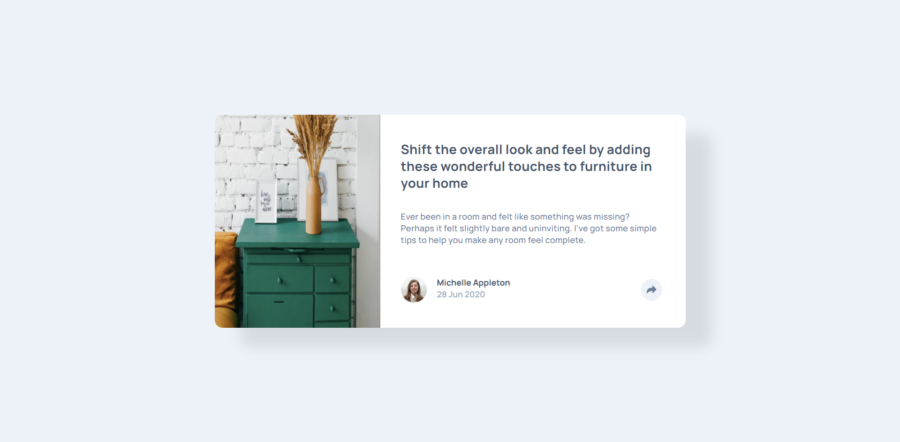

# Frontend Mentor - Article preview component solution

This is a solution to the [Article preview component challenge on Frontend Mentor](https://www.frontendmentor.io/challenges/article-preview-component-dYBN_pYFT). Frontend Mentor challenges help you improve your coding skills by building realistic projects. 

## Table of contents

- [Overview](#overview)
  - [The challenge](#the-challenge)
  - [Screenshot](#screenshot)
  - [Links](#links)
  - [Built with](#built-with)
  - [What I learned](#what-i-learned)
  - [Continued development](#continued-development)
  - [Author](#author)

## Overview

### The challenge

Users should be able to:

- View the optimal layout for the component depending on their device's screen size
- See the social media share links when they click the share icon
s
### Screenshot

### Links

- Solution URL:[https://github.com/codejeroo/meet-landing-page]
- Live Site URL:[https://codejeroo.github.io/meet-landing-page/]

### Built with

- Semantic HTML5 markup
- CSS custom properties
- Flex box
- CSS Grid

### What I learned
I learned a few css tricks like translate, transform and visibility as well as javascript for each function. I learned how to manipulate the DOM.

### Continued development

Honestly this solution is not that good, I just patched up what I think would work but its not good. Will update this soon once I get better but I'm proud I was able to pull it off by myself. 

## Author
- Frontend Mentor - [(https://www.frontendmentor.io/profile/codejeroo)]